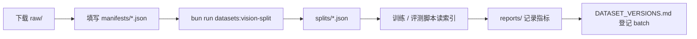

# 博士论文实验数据集目录（`doctor/datasets/`）

本目录存放博士论文相关的**公开数据集元数据、划分索引、脚本与实验记录**。与开题报告 [§3.5 / §6.0](../博士论文开题报告20260523-003.md) 对应，服务于 Vision Agent、Symptom Agent、阻抗控制、KG 校验等模块。

**设计原则：**

- **大文件不入 Git**：原始图像、音频、ROSbag 等放在各数据集的 `raw/`、`processed/`，由 [`.gitignore`](./.gitignore) 忽略。
- **可复现内容入库**：目录骨架、`manifests/` 元数据、`splits/*.json` 划分索引、`reports/` 统计与版本记录、工具脚本。
- **验证路径**：L1 公开数据离线实验 → L2 实验室实机 → L3 模拟/临床（见 [P0_CHECKLIST.md](./P0_CHECKLIST.md)）。

---

## 总览：目录树与职责

```
doctor/datasets/
│
├── README.md                      ← 本说明（目录百科）
├── P0_CHECKLIST.md                ← P0 阶段可勾选执行清单（2026.06–08）
├── .gitignore                     ← 忽略 raw/、大文件、PhysioNet 凭证等
│
├── manifests/                     ← 【元数据层】各数据集的“身份证”（可提交 Git）
│   ├── tcm-tongue-meta.json       ← 已填：类别、网盘链接、git commit、本地状态
│   ├── tcm-tongue-meta.template.json
│   └── tcm-fd-meta.template.json
│
├── scripts/                       ← 【工具层】初始化、划分、后续可扩展统计脚本
│   ├── setup-dirs.ts              ← 创建全部子目录骨架
│   └── vision-split.ts            ← 生成 train/val/test 索引 JSON
│
├── reports/                       ← 【实验记录层】跨数据集版本与变更日志
│   └── DATASET_VERSIONS.md        ← 记录 batch_id、split_seed、下载日期
│
├── vision/                        ← 【模态：视觉】舌诊、面诊、多模态舌象
├── control/                       ← 【模态：控制】协作臂力矩、阻抗实验数据
├── emr/                           ← 【模态：病历/语音】Symptom / EMR Agent
│   ├── physionet-dua.template.md  ← PhysioNet DUA 申请跟踪表（复制为 physionet-dua.md）
│   ├── mimic/raw/
│   └── voice-ehr/raw/
├── kg/                            ← 【模态：知识图谱】PrimeKG 等子图导出
└── sim/                           ← 【模态：仿真】ROS 2、Gazebo、ROSBag 日志
```

---

## 根目录文件

| 文件 | 作用 |
|------|------|
| **README.md** | 目录结构说明、命令速查、与各 Agent 的映射关系（本文件）。 |
| **P0_CHECKLIST.md** | 分步骤验收清单：环境搭建 → TCM-Tongue → TCM-FD → Mendeley → ROS 仿真 → PhysioNet 申请；含勾选框与验收标准。 |
| **.gitignore** | 防止误提交 `raw/`、`processed/`、压缩包、模型权重、PhysioNet 凭证等；**允许**提交 `manifests/`、`splits/`、`reports/*.md`。 |

---

## `manifests/` — 数据集元数据（清单层）

存放每个数据集的**描述性 JSON**，不存放图像本身。用于论文方法节引用、脚本读取类别名、记录下载来源与合规信息。

| 文件 | 状态 | 作用 |
|------|------|------|
| `tcm-tongue-meta.json` | **已填写** | TCM-Tongue：21 类、官方划分数量、Git commit、**百度网盘三链接**、`local_status`（是否已下完整图）。 |
| `tcm-tongue-meta.template.json` | 模板 | 新填数据集时复制改名。 |
| `tcm-fd-meta.template.json` | 模板 | TCM-FD（IEEE DataPort）待申请通过后填写。 |

**典型字段：** `dataset_id`、`classes`、`expected_image_count`、`full_images_source`（网盘/URL）、`git_commit`、`local_status`。

---

## `scripts/` — 自动化工具

| 脚本 | npm 命令 | 作用 |
|------|----------|------|
| `setup-dirs.ts` | `bun run datasets:setup` | 一次性创建 `vision/`、`control/` 等下所有 `raw|processed|splits|reports` 子目录及 `.gitkeep`。 |
| `vision-split.ts` | `bun run datasets:vision-split -- --dataset tcm-tongue` | 扫描 `vision/<name>/raw/` 下图像，生成 `splits/train.json` 等；若存在 `raw/images/{train,val,test}/` 则采用**官方划分**，否则按 `seed` 随机划分。 |

后续可在此增加：`control-schema.ts`（探查 Mendeley CSV）、`vision-stats.ts`（类别分布报告）等。

---

## `reports/` — 跨数据集实验版本

| 文件 | 作用 |
|------|------|
| **DATASET_VERSIONS.md** | 全局实验批次表：每次下载记录 `batch_id`、数据源版本、`split_seed`、划分比例；SCI 论文方法节可引用 `batch_id` 保证可复现。 |

各数据集目录下的 `reports/`（如 `vision/tcm-tongue/reports/`）存放**该数据集专属**统计（如 `stats.md`、混淆矩阵说明），与全局表互补。

---

## 五大模态目录（一级子目录）

按开题报告研究模块划分，**同级互不混放**（尤其院内临床数据不得放入公开 `raw/`）。

### `vision/` — 舌诊 / 面诊（Vision Agent、Edge-IQA）

| 子目录 | 数据集 | 优先级 | 说明 |
|--------|--------|--------|------|
| `tcm-tongue/` | TCM-Tongue | **P0** | 舌象目标检测，21 类；**当前已克隆 GitHub 元数据** |
| `tcm-fd/` | TCM-FD | **P0** | 面诊 20k+ 张，11 类指标 |
| `tongue-inquiry/` | 舌象+问诊文本 | P1 | Vision ↔ Symptom 多模态对齐 |
| `tmc-tongue/` | TMC-Tongue (Dryad) | P2 | 泛化与对比实验 |

### `control/` — 协作机器人控制（阻抗、Skills）

| 子目录 | 数据集 | 优先级 | 说明 |
|--------|--------|--------|------|
| `mendeley-iiwa/` | Mendeley LBR iiwa | **P0** | 力/扭矩、阻抗模式，约 450 序列；离线标定虚拟刚度/阻尼 |

### `emr/` — 语音与电子病历（Symptom / EMR Agent）

存放 Symptom Agent（主诉/ASR）与 EMR Architect Agent（结构化病历）相关的公开数据。PhysioNet 数据**必须先获批 DUA** 才能下载到本地 `raw/`。

| 路径 | 类型 | 优先级 | 作用 |
|------|------|--------|------|
| `voice-ehr/raw/` | 数据集目录 | P1 | Voice EHR（Bridge2AI）：语音 + 临床元数据；获批后 wget/官方工具下载至此 |
| `mimic/raw/` | 数据集目录 | P1 | MIMIC-IV：ICU 结构化记录、笔记、生命体征；Symptom/EMR 实验主数据源之一 |
| [`physionet-dua.template.md`](./emr/physionet-dua.template.md) | **跟踪表模板** | P0 并行 | 记录 DUA 申请进度；**入库的是模板，个人填写版不入 Git** |

#### `physionet-dua.template.md` — PhysioNet DUA 跟踪表

该文件**不是数据集**，而是放在 `emr/` 根下的**合规与进度台账**，与 `voice-ehr/`、`mimic/` 并列，避免 DUA 状态散落在笔记里。

**模板跟踪的数据集：**

| 数据集 | PhysioNet 页面 | 获批后数据落盘路径 |
|--------|----------------|-------------------|
| MIMIC-IV | https://physionet.org/content/mimiciv/ | `emr/mimic/raw/` |
| Voice EHR (Bridge2AI) | 按 PhysioNet 项目页填写 | `emr/voice-ehr/raw/` |

**表格字段含义：**

| 列 | 说明 |
|----|------|
| 申请日期 | 在 PhysioNet 提交 DUA 的日期 |
| 状态 | `Pending` / `Approved` / `Rejected` |
| 批准日期 | 可开始下载的日期 |
| 本地路径 | 解压后的根目录（与上表一致） |

**推荐使用方式：**

```bash
# 1. 复制模板为个人跟踪文件（已加入 .gitignore 逻辑：勿提交含个人信息的 dua）
cp emr/physionet-dua.template.md emr/physionet-dua.md

# 2. 在 physionet-dua.md 中填写申请日期与状态
# 3. DUA 获批后，将数据下载到对应 raw/，并更新 manifests（待建 mimic-meta.json 等）
```

**模板内已写明的使用约束（摘要）：**

- 仅用于学术研究，**不得再分发**原始数据。
- **不得在公有云 LLM API** 上传可识别患者信息（PHI）。
- 论文须按 PhysioNet 要求引用。

**与 P0 清单的关系：** [P0_CHECKLIST.md](./P0_CHECKLIST.md) 章节 **F. PhysioNet 预申请** 与本模板配合使用——清单负责勾选验收，模板负责长期记录状态与路径。

> **安全：** 勿将 PhysioNet 密码、`credentials.json`、`.physionet/` 凭证目录提交到 Git（见根目录 [`.gitignore`](./.gitignore)）。

### `kg/` — 知识图谱（防幻觉、逻辑校验）

| 子目录 | 数据集 | 优先级 | 说明 |
|--------|--------|--------|------|
| `primekg/` | PrimeKG 等 | P1 | 导出疾病-症状-药物子图至 `processed/` |

### `sim/` — ROS 2 / 云边端仿真

| 子目录 | 用途 | 优先级 | 说明 |
|--------|------|--------|------|
| `ros2-gazebo/` | TurtleBot3 / Franka demo | **P0** | `logs/` 存 bag/日志，`reports/latency.md` 存 DDS 时延 |

---

## 单个数据集的标准四级结构

每个具体数据集（如 `vision/tcm-tongue/`）建议采用统一布局，便于脚本与用户理解：

```
vision/tcm-tongue/
├── raw/                 # 原始数据区（Git 忽略）
│   ├── README.md        # 上游仓库说明（若 git clone 带入）
│   ├── DOWNLOAD.md      # 本仓库写的：百度网盘链接与解压路径
│   ├── demo/            # GitHub 自带的 14 张示例图
│   └── images/          # 【待解压】完整集：train / val / test
│       ├── train/
│       ├── val/
│       └── test/
├── processed/           # 清洗后：裁剪舌体、统一分辨率、YOLO 标签转换等（Git 忽略）
├── splits/              # 划分索引（可提交 Git）
│   ├── train.json       # 相对 raw/ 的图像路径列表
│   ├── val.json
│   ├── test.json
│   └── split-meta.json  # 划分模式(official/random)、seed、样本数
└── reports/             # 本数据集统计报告（建议提交）
    └── stats.md         # 类别分布、mAP 基线等（待生成）
```

### 四级目录含义

| 层级 | 目录/文件 | 作用 | 是否入 Git |
|------|-----------|------|------------|
| **raw** | 下载源 | 网盘/Git 原样或浅克隆；训练脚本只读 | 否 |
| **processed** | 中间产物 | 去噪、对齐标注、导出 COCO/YOLO 统一格式 | 否 |
| **splits** | 实验索引 | 记录哪些文件属于 train/val/test，保证论文可复现 | **是** |
| **reports** | 分析输出 | 人工或脚本生成的统计、图表说明 | **是** |

---

## 当前进度示例：`vision/tcm-tongue/`

| 路径 | 状态 | 说明 |
|------|------|------|
| `raw/` | 已 `git clone` | 含上游 README、YOLO 类别配置、`demo/` 14 张图；**完整 6719 张需百度网盘** |
| `raw/DOWNLOAD.md` | 已写 | COCO/TXT/XML 三份网盘链接与解压说明 |
| `manifests/tcm-tongue-meta.json` | 已写 | 含 `full_images_downloaded: false` |
| `splits/` | 已生成（demo） | 基于 14 张 demo 随机划分；完整集解压后需**重新运行** vision-split |
| `processed/` | 空 | 待清洗流水线 |
| `reports/` | 空 | 待 `stats.md` |

**百度网盘（完整图像）：**

| 格式 | 链接 | 提取码 |
|------|------|--------|
| COCO（推荐） | https://pan.baidu.com/s/1H2PYhz3ObAmXUHKu25TuDw | `b02g` |
| TXT (YOLO) | https://pan.baidu.com/s/1ioQgU6rQ0KNqHndPyURd3w | `xh4d` |
| XML | https://pan.baidu.com/s/1NAgA5AiVI2Gt9zoBDxbiHg | `qv55` |

---

## 数据流（从下载到训练）



1. 数据放入 `*/raw/`（或按 `DOWNLOAD.md` 解压）。  
2. 更新 `manifests/<dataset>-meta.json` 的日期、版本、`local_status`。  
3. 运行划分脚本 → 得到 `splits/`。  
4. 训练代码**只通过 JSON 索引引用路径**，不硬编码绝对路径。  
5. 将 `split_seed`、`batch_id` 写入 `reports/DATASET_VERSIONS.md`。

---

## 与论文章节的对应关系

| 目录 | 开题报告模块 | Agent / 算法 |
|------|--------------|----------------|
| `vision/` | §3.3.1 多模态特征提取 | Vision Agent、Edge-IQA |
| `control/` | §3.2.2 自适应阻抗控制 | Action Agent、ros2_control |
| `emr/` | §3.3.3 EMR 生成 | Symptom / EMR Architect Agent |
| `kg/` | §3.3.2 KG 防幻觉 | EMR Architect、冲突节点 |
| `sim/` | §3.4.1 分布式协同 | DDS/gRPC 时延、Skills 仿真 |

---

## 命令速查

```bash
# 初始化全部子目录（首次或换机器）
bun run datasets:setup

# 生成视觉数据集划分（tcm-tongue | tcm-fd）
bun run datasets:vision-split -- --dataset tcm-tongue
bun run datasets:vision-split -- --dataset tcm-tongue --seed 42 --train 0.7 --val 0.15
```

---

## 合规与安全

- **PhysioNet**：须 CITI 培训 + [账号认证与 DUA](https://physionet.org/settings/credentialing/)；进度与落盘路径见 [`emr/physionet-dua.template.md`](./emr/physionet-dua.template.md)（复制为 `emr/physionet-dua.md` 本地填写，勿提交凭证）。  
- **公有云 LLM**：不得上传含 PHI 的 MIMIC/语音原始数据。  
- **院内数据**：单独目录、伦理审批，不与 `doctor/datasets/**/raw` 混用。

---

## 相关文档

| 文档 | 路径 |
|------|------|
| 开题报告 §3.5 | [博士论文开题报告20260523-003.md](../博士论文开题报告20260523-003.md) |
| P0 执行清单 | [P0_CHECKLIST.md](./P0_CHECKLIST.md) |
| TCM-Tongue 下载说明 | [vision/tcm-tongue/raw/DOWNLOAD.md](./vision/tcm-tongue/raw/DOWNLOAD.md) |
| PhysioNet DUA 跟踪模板 | [emr/physionet-dua.template.md](./emr/physionet-dua.template.md) |
| 版本登记 | [reports/DATASET_VERSIONS.md](./reports/DATASET_VERSIONS.md) |
