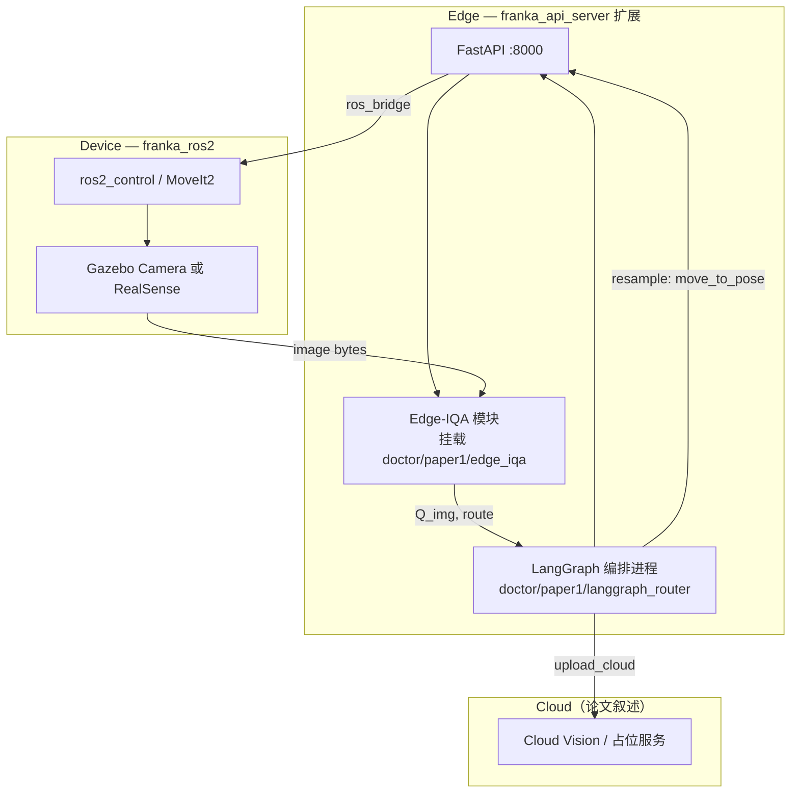

# 论文 I 科研规划（V18 × franka_ros2 整合版）

> **已并入 V19**：[科研规划_论文I_V19.md](./科研规划_论文I_V19.md) — 请以 V19 为准。  
> **版本**：2026-05-29（归档）  
> **约束**：[role.md](../role.md)  
> **论文蓝图**：[论文1_V18.md](./论文1_V18.md)、[论文1_V18_AI执行手册.md](./论文1_V18_AI执行手册.md)、[论文1_V18_tasks.json](./论文1_V18_tasks.json)  
> **本地工程**：`\\wsl.localhost\Ubuntu2404\root\work\franka_ros2`（WSL：`/root/work/franka_ros2`）  
> **算法与实验仓**：`e:\work\ppt-builder\doctor\paper1\`（本仓库）  
> **投稿目标**：**2026 年 9 月**向 SCI 投稿（RA-L / RCIM 优先；T-ASE 可作扩展稿）

---

## 1. 规划总述

### 1.1 一句话定位

论文 I 的**算法与可复现实验**在 `doctor/paper1` + `doctor/datasets` 完成；**云边端闭环的物理/仿真验证**复用已有 `franka_ros2` 工作区（ROS 2 Jazzy、Gazebo、MoveIt、FastAPI 边侧网关），避免从零搭建 Webots/ROS 栈，并符合 role.md「软件架构 + 算法创新、弱化阻抗」导向。

### 1.2 双仓分工（必须遵守）

| 仓库 | 路径 | 职责 | 论文中的角色 |
|------|------|------|----------------|
| **ppt-builder** | `doctor/paper1/` | Edge-IQA、LangGraph 路由、离线主实验、LaTeX、图表 CSV | **核心贡献与主实验（M1–M5）** |
| **franka_ros2** | `/root/work/franka_ros2` | 机械臂 Skills 执行、相机/仿真采集、边侧 HTTP 网关、RTT 实测 | **§3 架构示意 + 补充实验 / Supplementary** |

算法代码**不**散落到 `franka_ros2` 各功能包内；通过 **API 扩展 + 子进程/挂载调用** `doctor/paper1` 中的 Python 模块，保证开源边界清晰。

### 1.3 与 role.md / 开题的对齐

| role.md 要求 | 本规划处理方式 |
|--------------|----------------|
| 算法 + 公开数据集 | 主实验以 TCM-Tongue 离线回放为主；franka 仅验证「闭环可触发」 |
| LangGraph + Edge-IQA | 实现在 `doctor/paper1`，不由 ROS 包替代 |
| 弱化阻抗/力控 | **禁止**将 `franka_api_server` 的 stiffness/collision 配置 API 写入论文 I 实验 |
| 9–12 月论文 I | 本规划按 **9 月投稿** 压缩；12 月为修订/二投缓冲 |
| 开题 008 与 V18 不一致 | 投稿前开题 §5.3.1 需改为 V18 题目（Edge-IQA + 路由），阻抗归入博士论文他章 |

---

## 2. franka_ros2 工程资产盘点

### 2.1 可直接复用（高匹配）

| 模块 | 路径 | 能力 | 对应 V18 任务 |
|------|------|------|----------------|
| **边侧服务网关** | `franka_api_server/` | FastAPI REST + WebSocket + `ros_bridge.py`（rclpy） | P1-T02 的**替代实现**（HTTP 边网关，论文 §3 可写 REST/gRPC 并列） |
| **一键联调** | `scripts/testall.sh` | MoveIt fake hardware + API Server | P1-T03 联调基线 |
| **假硬件 MoveIt** | `scripts/start.sh`、`franka_fr3_moveit_config/` | `use_fake_hardware:=true`，position 控制 | P1-T03「预定义 pose 重拍」 |
| **Gazebo 仿真** | `franka_gazebo_bringup/` | `gazebo_franka_arm_example_controller.launch.py`、`sensor_demo_world.sdf` | 替代 V18 原 Webots 方案（P1-T03） |
| **移动平台+相机** | `franka_mobile_sensors/` | RealSense D455 配置、`franka_mobile_d455.yaml` | 实机/高保真仿真的 `capture` 图像源（可选） |
| **运动 Skills 原型** | `franka_api_server/routers/motion.py` | `move_joints`、`move_to_pose`（MoveIt2） | 映射为 `go_to_tongue_pose` / `go_to_face_pose` |
| **状态与时间戳** | `routers/status.py`、`routers/ws.py` | 关节状态、WebSocket 推送 | RTT 日志中的「执行段」计时 |
| **文档与规范** | `docs-zh/`、`AGENTS.md` | 中文运维说明、构建约定 | 团队执行手册附录 |

### 2.2 部分相关（需裁剪后使用）

| 模块 | 说明 | 论文 I 用法 |
|------|------|-------------|
| `franka_api_server/routers/controller.py` | 刚度、碰撞行为配置 | **不写入实验**；仅博士论文阻抗章预留 |
| `franka_hardware` / `libfranka` | 真机 UDP 控制 | 9 月前**非必须**；有真机则作 Supplementary 1 组 |
| `franka_mobile` | 全向移动底盘 | 论文 I 不强调移动导航，避免「系统过大」 |
| `verify_motion.py` | Playwright 前端 E2E | 可改为「API 触发 pose + 记录 RTT」的回归测试，不进正文 |

### 2.3 当前缺失（须在 ppt-builder 或 franka 扩展中补齐）

| 缺口 | V18 原设计 | 整合方案 |
|------|------------|----------|
| Edge-IQA | `edge_iqa/scorer.py` | 在 `doctor/paper1` 实现；franka 增加 `POST /api/v1/vision/evaluate` 转发 |
| LangGraph 路由 | `langgraph_router/` | 仅在 `doctor/paper1`；通过 API 调用 `resample` / `upload` |
| gRPC `EvaluateImage` | P1-T02 proto | **可选**：与现有 FastAPI 并存；审稿友好可保留 gRPC 子模块 |
| TCM-Tongue 全量 | ≥6000 张 | **阻塞项**：网盘下载后重跑 split（与 franka 无关） |
| 网络抖动注入 | `netem` / tc | WSL 宿主机 `tc netem` 或 Docker `NET_ADMIN`；主实验仍可离线仿真 |
| 舌象采集专用场景 | Webots 舌象台 | Gazebo 静态屏显 TCM 图像 + 腕部相机位姿；或**纯离线回放** |

---

## 3. 匹配度评估矩阵

**图例**：● 完全覆盖　◐ 需薄封装　○ 不覆盖/不做

| V18 能力项 | franka_ros2 | doctor/paper1 | 综合 |
|------------|-------------|---------------|------|
| 云-边-端三层叙述 | ◐ API+ROS | ○ | ● 合并叙述 |
| 边缘 IQA &lt;30ms | ○ | ● 待实现 | ● |
| LangGraph 条件路由 | ○ | ● 待实现 | ● |
| 闭环重拍（pose） | ● MoveIt/API | ◐ 路由逻辑 | ● |
| 图像采集 | ◐ Gazebo/RealSense | ◐ 数据集回放 | ● |
| RTT / 有效率 M1–M2 | ◐ WS+API 计时 | ● 离线矩阵 | ● 双轨 |
| 消融 τ、跨集 M4–M5 | ○ | ● 待实现 | ● |
| 阻抗/力控 | ● 有但不使用 | ○ 不做 | ○ 刻意排除 |
| 公开数据集主实验 | ○ | ● TCM-Tongue | ● |

**结论**：franka_ros2 与论文 I 的匹配度约 **55%（工程底座）**；加上 `doctor/paper1` 算法轨后可达 **90%+**。剩余 10% 为数据全量、LangGraph 与主实验数字。

---

## 4. 目标系统架构（整合后）



**闭环序列（与 V18 §4.3 一致）**：

1. `capture`：API 触发相机或读取数据集路径  
2. `edge_iqa`：调用 `compute_q()` → `Q_img`, flags  
3. `route`：`Q_img ≥ τ` → `upload_cloud`；否则 `resample_edge` → `move_to_pose`（预定义舌位/面位）  
4. `retry_count > K` → `fail_safe`

---

## 5. 代码与目录映射

### 5.1 doctor/paper1（新建，算法主仓）

```
doctor/paper1/
├── README.md
├── 科研规划_论文I_V18_franka_ros2整合.md   # 本文档
├── edge_iqa/                 # P2：scorer、tests
├── langgraph_router/         # P3：state、graph、routing、iqa_client
├── sim/
│   ├── grpc_bridge/          # 可选，与 FastAPI 二选一或并存
│   └── franka_bridge/        # 新增：调用 franka API 的薄客户端
├── experiments/              # P4–P5：yaml、run_matrix、results、plot
├── figures/
├── latex/
└── patent/
```

### 5.2 franka_ros2（仅扩展，不 fork 算法）

建议新增（**一个** ROS 包或扩展现有 `franka_api_server`）：

```
franka_api_server/franka_api_server/routers/vision.py   # POST /vision/evaluate, /vision/capture
franka_api_server/franka_api_server/skills/poses.yaml   # tongue_pose, face_pose 关节/笛卡尔目标
scripts/paper1_closed_loop.sh                           # 启动 testall + LangGraph 一次试验
```

**环境变量**（`paper1_closed_loop.sh`）：

```bash
export PAPER1_ROOT="/mnt/e/work/ppt-builder/doctor/paper1"   # WSL 挂载 Windows 盘
export FRANKA_API_URL="http://127.0.0.1:8000"
export FRANKA_API_KEY="franka-api-default-key"
```

---

## 6. 分阶段科研计划（2026.06 – 2026.09）

> 在 V18 的 P0–P6 上合并 franka 轨道；**加粗**为关键路径。

### Phase 0：数据与双仓打通（06.01 – 06.21，3 周）

| ID | 任务 | 主仓 | 验收 |
|----|------|------|------|
| **P0-T02** | TCM-Tongue 网盘全量 → `raw/` | datasets | ≥6000 张 |
| P0-T03/04 | split + stats.md | datasets | 70/15/15 |
| F0-01 | WSL 挂载验证：`ppt-builder` ↔ `/mnt/e/work/ppt-builder` | 环境 | `python3 -c "import doctor.paper1"` 或路径存在 |
| F0-02 | franka：`colcon build` + `scripts/testall.sh` 通过 | franka_ros2 | API :8000 可访问 |

### Phase 1：边网关 + 最小采集（06.15 – 07.05，与 P0 重叠）

| ID | 任务 | 主仓 | 验收 |
|----|------|------|------|
| P1-T01 | 创建 `doctor/paper1` 目录骨架 | paper1 | 与 V18 §五一致 |
| P1-T02 | **方案 A**：`sim/grpc_bridge`；**方案 B（推荐）**：扩展 FastAPI `/vision/*` | paper1 + franka | 返回 `q_score`, `flags` |
| **P1-T03** | Gazebo：`gazebo_franka_arm_example_controller` + 静态舌象纹理 | franka | 保存 `capture_001.png` |
| P1-T04 | 架构图 fig1（Device–Edge–Cloud + Edge-IQA + LangGraph） | paper1/figures | PDF/SVG |
| F1-01 | `skills/poses.yaml`：`tongue_pose`, `face_pose` 两档 | franka | API `move_to_pose` 可达 |

### Phase 2：Edge-IQA（07.01 – 07.28）

| ID | 任务 | 主仓 | 验收 |
|----|------|------|------|
| **P2-T01–T03** | scorer + val 标定 τ + latency &lt;30ms | paper1 | 清晰/模糊均值差 &gt;0.2 |
| F2-01 | API `/vision/evaluate` 调用 `edge_iqa.scorer` | franka | 100 次 p95 &lt;30ms |
| P2-T04 | §4.1 LaTeX 初稿 | paper1/latex | ≤800 词 |

### Phase 3：LangGraph 路由 + 闭环（07.15 – 08.15）

| ID | 任务 | 主仓 | 验收 |
|----|------|------|------|
| **P3-T01–T03** | StateGraph + routing + franka_bridge 客户端 | paper1 | `run_001.jsonl` 含时间戳 |
| F3-01 | `paper1_closed_loop.sh` 端到端 10 trial | franka+paper1 | 日志可解析 RTT |
| P3-T04/05 | fig2 + §4.2–4.3 | paper1 | 与代码一致 |

### Phase 4：主实验（07.25 – 08.25）

| 轨道 | 内容 | 用途 |
|------|------|------|
| **主轨（必做）** | 离线 `run_matrix.py` + TCM-Tongue test + 合成退化/网络延迟模型 | 论文 **M1–M3 主图** |
| **辅轨（选做）** | franka fake hardware + netem 50 trial | Supplementary / 审稿「真实链路」回应 |

| ID | 任务 | 验收 |
|----|------|------|
| P4-T01–T04 | B0/B1/B2（+可选 B3 学习 IQA）+ Fig.5–6 | B2 优于 B0 方向正确 |
| P4-T05 | §5.1–5.2 | 数字与 CSV 一致 |

### Phase 5：消融、跨集、初稿（08.10 – 09.10）

| ID | 任务 | 验收 |
|----|------|------|
| P5-T01 | τ 消融 Fig.7 | 5 档 τ |
| P5-T02 | TCM-FD 或合成跨集 M5 | Spearman≥0.75 或域差异说明 |
| **P5-T03–T04** | `main.tex` Draft v1 + Abstract 含 M1/M2 数字 | latexmk 通过 |
| P2-T05 | 专利交底书 | 3–5 条权利要求 |

### Phase 6：投稿（09.10 – 09.30）

| ID | 任务 | 产出 |
|----|------|------|
| P6-T01–T02 | 润色 + references.bib ≥30 | 终稿 |
| P6-T03 | 投稿 RA-L 或 RCIM + arXiv | `submission/log.md` |

---

## 7. 实验设计（整合版）

### 7.1 基线（与 V18 一致，建议增加 B3）

| 代号 | 描述 | 实现位置 |
|------|------|----------|
| B0 | 全云端 IQA，无边缘过滤 | `experiments/` 离线 |
| B1 | 边缘 IQA + 固定阈值，无 LangGraph 动态路由 | paper1 |
| B2 | Edge-IQA + Confidence-Aware Routing（本文） | paper1 + 可选 franka |
| B3（建议） | 边缘 CNN-IQA + 无路由 | paper1，val 微调小模型 |

### 7.2 指标与数据来源

| 指标 | 定义 | 主数据来源 | franka 辅轨 |
|------|------|------------|-------------|
| M1 | 闭环 RTT p50/p95 | 离线日志 | API+WS 实测 |
| M2 | 有效采集率 | TCM-Tongue test | Gazebo 50 trial |
| M3 | 云端无效上传占比 | 离线 | — |
| M4 | τ 消融 | 离线 | — |
| M5 | 跨集 Spearman | TCM-FD 或合成退化 | — |

### 7.3 论文 §5 表述策略

- **主结果**：公开数据集 + 可复现脚本（审稿人最看重）  
- **系统验证**：1 段 + 1 张小图：「Franka FR3 fake hardware + 边侧 API 闭环」  
- **不写**：阻抗曲线、刚度参数扫描、移动底盘导航

---

## 8. 里程碑与检查点

| 日期 | 里程碑 | 必达产出 |
|------|--------|----------|
| 2026-06-30 | 数据 P0 关闭 | 全量 TCM-Tongue split；franka testall 稳定 |
| 2026-07-31 | 算法 α | Edge-IQA + API `/vision/evaluate`；τ 初值 |
| 2026-08-15 | 闭环 β | LangGraph + jsonl；**M1–M3 初版 CSV** |
| 2026-08-31 | 文稿 γ | LaTeX Draft v1 可编译 |
| **2026-09-30** | **投稿** | RA-L/RCIM + arXiv |

**导师检查点（建议）**：

- 7 月中旬：确认开题论文 I 题目已改为 V18  
- 8 月初：主图数字是否支持 Abstract 中 30%/15% 量级声明  
- 9 月初：期刊选择与一稿多投策略

---

## 9. 风险与对策

| 风险 | 影响 | 对策 |
|------|------|------|
| TCM-Tongue 未下完 | M2/M4/M5 无效 | 6 月优先网盘；短期用官方 train/val 子集 + 合成退化 |
| ROS Humble vs Jazzy 不一致 | 构建失败 | 以本机 Jazzy 为准；CI 文档注明；Docker 仅作备份 |
| franka 无舌象专用场景 | §5 仿真偏弱 | 主实验离线；Gazebo 屏显 + 腕部相机作示意 |
| FastAPI 非 gRPC | 与 V18 手稿不一致 | 论文写「HTTP/gRPC 边接口」；gRPC 作补充实现 |
| 9 月时间紧 | 投稿延期 | 9 月 arXiv + 10 月期刊；削减 franka 辅轨 |
| 开题 008 仍为阻抗题 | 答辩风险 | 同步修订 §5.3.1 |

---

## 10. 与 V18 任务 JSON 的映射（franka 增量）

在 `论文1_V18_tasks.json` 中可增加 `franka_ros2` 字段（可选），或按下表手工跟踪：

| 新增 ID | 依赖 | 说明 |
|---------|------|------|
| F0-01 | — | WSL 路径与环境 |
| F0-02 | — | testall 冒烟 |
| F1-01 | P1-T03 | poses.yaml Skills |
| F2-01 | P2-T01 | API 挂载 Edge-IQA |
| F3-01 | P3-T03 | 闭环脚本 10 trial |

---

## 11. 近期行动清单（本周）

1. **下载 TCM-Tongue 全量**并重跑 `bun run datasets:vision-split -- --dataset tcm-tongue`。  
2. **WSL**：确认 `/mnt/e/work/ppt-builder` 可访问；在 `franka_ros2` 执行 `colcon build` + `scripts/testall.sh`。  
3. **创建** `doctor/paper1/edge_iqa/` 与 `langgraph_router/`（P1-T01）。  
4. **在 franka_api_server 增加** `routers/vision.py` 占位（转发至 PAPER1_ROOT）。  
5. **与导师确认**：论文 I = V18（非开题 008 阻抗题）；首投 **RA-L** 或 **RCIM**。

---

## 12. 文档索引

| 文档 | 用途 |
|------|------|
| [role.md](../role.md) | 总体约束 |
| [论文1_V18.md](./论文1_V18.md) | 论文大纲与指标 |
| [论文1_V18_AI执行手册.md](./论文1_V18_AI执行手册.md) | 分任务 AI 提示词 |
| [论文1_V18_tasks.json](./论文1_V18_tasks.json) | 任务 DAG 状态 |
| [datasets/P0_CHECKLIST.md](../datasets/P0_CHECKLIST.md) | 数据验收 |
| `franka_ros2/docs-zh/API_SERVICE_LAYER_PLAN.md` | 边侧 API 设计参考 |
| `franka_ros2/AGENTS.md` | franka 仓构建规范 |

---

*本文档为论文 I 唯一整合型科研规划；后续修订请更新文首版本日期，并与 tasks.json 的 `deadline` 保持同步（建议改为 `2026-09-30`）。*
