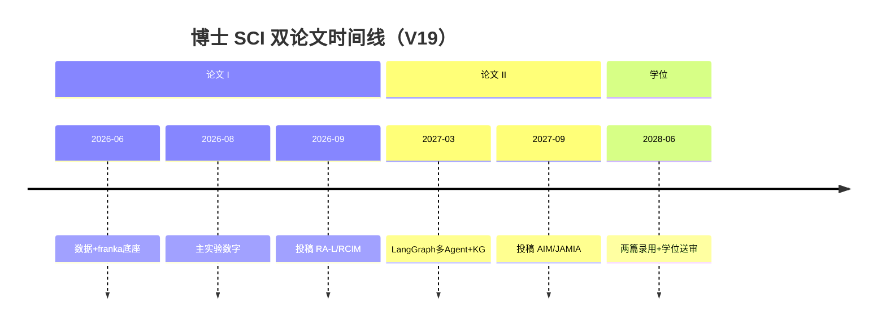
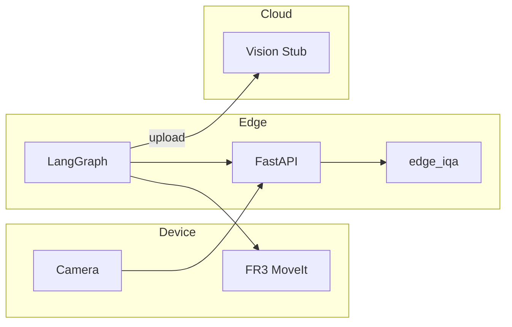

# 论文 I 科研规划（V19 正式版）

> **版本**：V19 | 2026-05-29  
> **状态**：当前有效；取代 [科研规划_论文I_V18_franka_ros2整合.md](./科研规划_论文I_V18_franka_ros2整合.md)  
> **大纲**：[论文1_V19.md](./论文1_V19.md)  
> **约束**：[role.md](../role.md)  
> **任务 DAG**：[论文1_V19_tasks.json](./论文1_V19_tasks.json)  
> **AI 执行**：[论文1_V19_AI执行手册.md](./论文1_V19_AI执行手册.md)

---

## 第一部分：战略总览

### 1.1 研究目标

在 **2026 年 9 月 30 日前** 向 SCI 期刊（优先 *IEEE RA-L* 或 *RCIM*）投稿论文 I，题目聚焦 **Edge-IQA + LangGraph 置信度感知路由**，以 **TCM-Tongue** 公开数据集主实验论证云边协同采集闭环的 **RTT 降低**与**有效采集率提升**，并用 **franka_ros2** 提供可复现的机器人执行辅轨。

### 1.2 V19 相对 V18 的主要变更

| 变更项 | V18 | V19 |
|--------|-----|-----|
| 投稿时间 | 2026-12 | **2026-09-30** |
| 仿真栈 | Webots 为主 | **Gazebo + franka_ros2** 为主 |
| 边网关 | gRPC 骨架 | **FastAPI（franka_api_server）+ 可选 gRPC** |
| 基线 | B0–B2 | **B0–B3**（含学习 IQA） |
| 科学问题 | 隐含 | **SQ1/SQ2 显式** |
| 大纲 | Section 级 | **段落级 + 图表总表** |
| 任务 | 33 项 paper1 only | **+5 项 franka（F0–F3 等）** |
| 规划文档 | 独立整合 md | **本文件为唯一科研规划主文档** |

### 1.3 双论文与博士论文衔接



| 篇章 | 核心 | 数据集 | 期刊方向 |
|------|------|--------|----------|
| **论文 I（本期）** | Edge-IQA + 路由 | TCM-Tongue, TCM-FD | T-ASE / RA-L / RCIM |
| **论文 II** | KG 防幻觉 + 多 Agent EMR | MIMIC/语音 EHR + 舌诊 | AIM / JAMIA / IEEE TMR |

---

## 第二部分：工程与仓库规划

### 2.1 双仓职责（不可混写算法）

| 仓库 | 路径 | 职责 |
|------|------|------|
| **ppt-builder** | `e:\work\ppt-builder\doctor\` | 数据集、Edge-IQA、LangGraph、离线实验、LaTeX、投稿包 |
| **franka_ros2** | `\\wsl.localhost\Ubuntu2404\root\work\franka_ros2` | ROS 2 Jazzy、MoveIt fake HW、Gazebo、FastAPI 边网关、pose Skills |

**挂载**：WSL 内 `export PAPER1_ROOT=/mnt/e/work/ppt-builder/doctor/paper1`

### 2.2 franka_ros2 匹配度与复用清单

| 模块 | 匹配论文 I | 用法 |
|------|------------|------|
| `franka_api_server` | ● | 边侧 REST/WS；扩展 `/api/v1/vision/*` |
| `scripts/testall.sh` | ● | 联调冒烟 |
| `franka_gazebo_bringup` | ● | 采集仿真 |
| `franka_fr3_moveit_config` | ● | 预定义 pose 重拍 |
| `franka_mobile_sensors` | ◐ | RealSense（可选，非核心） |
| `routers/controller.py`（刚度） | ○ | **论文 I 禁用** |

### 2.3 目标架构

见 [论文1_V19.md](./论文1_V19.md) §3 与下图。



### 2.4 目录结构（验收用）

**doctor/paper1/**（须于 P1-T01 创建）：

```
edge_iqa/          langgraph_router/     sim/franka_bridge/
experiments/       figures/             latex/sections/
patent/            submission/
```

**franka_ros2/**（须于 F1/F2 扩展）：

```
franka_api_server/franka_api_server/routers/vision.py
franka_api_server/franka_api_server/skills/poses.yaml
scripts/paper1_closed_loop.sh
```

---

## 第三部分：实验与论文产出规划

### 3.1 科学问题与假设

| ID | 科学问题 | 可检验假设 |
|----|----------|------------|
| **SQ1** | 边缘能否在 &lt;30ms 内可靠评估舌象质量？ | p95 延迟 &lt;30ms；清晰/模糊 $Q$ 均值差 &gt;0.2 |
| **SQ2** | 置信度路由是否优于固定 FSM？ | B2 相对 B0：M1↓≥30%，M2↑≥15%，M3↓≥40% |

### 3.2 实验双轨策略

| 轨道 | 方法 | 数据 | 论文地位 |
|------|------|------|----------|
| **主轨** | `run_matrix.py` 离线回放 + 合成退化 + 延迟模型 | TCM-Tongue test ≥500/seed | §5.2 主图 |
| **辅轨** | `paper1_closed_loop.sh` + fake hardware | 50 trials | §5.5 / Supp. |

### 3.3 基线与指标

完整定义见 [论文1_V19.md](./论文1_V19.md) §2.3、§3。实验配置 YAML：

- `experiments/configs/main_exp.yaml` — B0–B3  
- `experiments/configs/ablation_tau.yaml` — M4  

### 3.4 写作产出时间表

| 产出 | 截止 | 依赖 |
|------|------|------|
| §4.1 初稿 | 07-28 | P2 |
| §4.2–4.3 | 08-15 | P3 |
| §5.1–5.2 + Fig.5–6 | 08-25 | P4 |
| `main.tex` Draft v1 | 08-31 | P5-T03 |
| Abstract 含 M1/M2 数字 | 09-10 | P5-T04 |
| 投稿包 | 09-30 | P6 |

---

## 第四部分：分阶段执行计划（2026.06–09）

### Phase P0：数据就绪（06.01–06.21）

| ID | 任务 | 命令/路径 | 验收 |
|----|------|-----------|------|
| P0-T01 | 目录骨架 | `cd e:\work\ppt-builder && bun run datasets:setup` | P0_CHECKLIST §A |
| **P0-T02** | TCM-Tongue 全量 | 网盘 → `vision/tcm-tongue/raw/` | ≥6000 张 |
| P0-T03 | split | `bun run datasets:vision-split -- --dataset tcm-tongue` | 70/15/15 |
| P0-T04 | stats.md | 脚本统计 21 类 | 可供 §5.1 引用 |

### Phase F0：franka 环境（与 P0 并行）

| ID | 任务 | 验收 |
|----|------|------|
| F0-01 | WSL 挂载 `ppt-builder` | `PAPER1_ROOT` 可读 |
| F0-02 | `colcon build` + `scripts/testall.sh` | `http://localhost:8000` 可访问 |

### Phase P1：架构与采集（06.15–07.05）

| ID | 任务 | 验收 |
|----|------|------|
| P1-T01 | paper1 代码仓 | 目录与 V19 §5 一致 |
| P1-T02 | 边接口：`sim/grpc_bridge` **或** franka `/vision/evaluate` | 返回 `q_score`, `flags` |
| P1-T03 | Gazebo 最小采集 | `experiments/debug/capture_001.png` |
| P1-T04 | Fig.1 架构图 | PDF + 英图注 |
| F1-01 | `poses.yaml` 舌/面位姿 | API `move_to_pose` 成功 |

### Phase P2：Edge-IQA（07.01–07.28）

| ID | 任务 | 验收 |
|----|------|------|
| P2-T01 | `scorer.py` + tests | 均值差 &gt;0.2 |
| P2-T02 | val 标定 τ | `calibration_val.csv` |
| P2-T03 | latency benchmark | CPU p95 &lt;30ms |
| P2-T04 | `04_1_edge_iqa.tex` | ≤800 词 |
| F2-01 | franka API 挂载 scorer | 与 P2-T03 一致 |
| P2-T05 | 专利交底 | 3–5 权利要求 |

### Phase P3：LangGraph（07.15–08.15）

| ID | 任务 | 验收 |
|----|------|------|
| P3-T01 | `state.py`, `graph.py` | State 字段齐全 |
| P3-T02 | `routing.py` + tests | 三分支覆盖 |
| P3-T03 | `franka_bridge` + jsonl | `run_001.jsonl` |
| P3-T04 | Fig.2 | 与代码一致 |
| P3-T05 | §4.2–4.3 tex | 公式一致 |
| F3-01 | `paper1_closed_loop.sh` | 10 trial 可解析 |

### Phase P4：主实验（07.25–08.25）

| ID | 任务 | 验收 |
|----|------|------|
| P4-T01 | `main_exp.yaml`, `run_matrix.py` | B0–B3 |
| P4-T02 | 延迟注入文档/脚本 | 0–500ms 可复现 |
| P4-T03 | 批量实验 | 3 seeds × ≥500 帧 |
| P4-T04 | Fig.5–6 | B2 优于 B0 方向 |
| P4-T05 | §5.1–5.2 | 数字=CSV |

### Phase P5：消融与初稿（08.10–09.10）

| ID | 任务 | 验收 |
|----|------|------|
| P5-T01 | τ 消融 Fig.7 | 5 档 τ |
| P5-T02 | M5 跨集报告 | Spearman 或域说明 |
| P5-T03 | `main.tex` 可编译 | 无 ?? 引用 |
| P5-T04 | Abstract + §1–2 + §6 | 含 M1/M2 |

### Phase P6：投稿（09.10–09.30）

| ID | 任务 | 验收 |
|----|------|------|
| P6-T01 | 润色 | 贡献=实验一致 |
| P6-T02 | bib ≥30 | 主题对齐开题 |
| P6-T03 | 投稿 + arXiv | `submission/log.md` |

---

## 第五部分：里程碑与治理

### 5.1 硬性里程碑

| 日期 | 代号 | 必达 |
|------|------|------|
| 2026-06-30 | **M0** | 数据全量 + franka testall |
| 2026-07-31 | **Mα** | Edge-IQA + τ |
| 2026-08-15 | **Mβ** | M1–M3 CSV |
| 2026-08-31 | **Mγ** | LaTeX Draft v1 |
| **2026-09-30** | **Mσ** | 期刊投稿 + arXiv |

### 5.2 导师检查点

| 时间 | 议题 |
|------|------|
| 07-15 | 开题论文 I 题目是否已改为 V19 方向 |
| 08-01 | M1/M2 是否达 Abstract 承诺量级 |
| 09-01 | RA-L vs RCIM；是否需压缩篇幅 |

### 5.3 每周例会自检（建议）

- [ ] `论文1_V19_tasks.json` 本周任务 `done` 数  
- [ ] `experiments/results/` 是否有新 CSV  
- [ ] LaTeX 与 CSV 数字是否一致  

---

## 第六部分：风险登记册

| ID | 风险 | 概率 | 影响 | 缓解 |
|----|------|------|------|------|
| R1 | 数据未下完 | 高 | 高 | 6月优先；合成退化 |
| R2 | 9月稿不及 | 中 | 中 | arXiv 先行 |
| R3 | 开题008题目冲突 | 中 | 高 | 修订 §5.3.1 |
| R4 | ROS 版本混乱 | 中 | 低 | 统一 Jazzy |
| R5 | 审稿人质疑 IQA 简单 | 中 | 中 | B3 + flags 可解释 |
| R6 | franka 无舌象场景 | 高 | 低 | 主轨离线 |

---

## 第七部分：成果清单（投稿时齐套）

| 类型 | 件数 | 说明 |
|------|------|------|
| SCI 论文 I | 1 | PDF + cover letter + highlights |
| 发明专利交底 | 1 | P2-T05 |
| 开源仓库 | 1 | GitHub 镜像 paper1 算法部分 |
| 实验复现包 | 1 | configs + README + seed |
| 博士论文素材 | — | §4–5 图表可直接下沉 |

---

## 第八部分：近期两周行动（2026.05.29 起）

| 优先级 | 行动 | 负责人 |
|--------|------|--------|
| P0 | 百度网盘 TCM-Tongue 全量下载 | 学生 |
| P0 | `bun run datasets:vision-split` | 学生/AI |
| P0 | franka `colcon build` + testall | 学生 |
| P1 | 创建 `doctor/paper1` 骨架（P1-T01） | AI |
| P1 | franka `vision.py` 占位 | AI/学生 |
| 行政 | 与导师确认 V19 题目 + 首投期刊 | 学生 |

---

## 第九部分：文档体系（V19）

```
doctor/paper1/
├── 论文1_V19.md                 ← 完整大纲（写作）
├── 科研规划_论文I_V19.md         ← 本文件（执行）
├── 论文1_V19_AI执行手册.md
├── 论文1_V19_tasks.json
├── 论文1_V18*.md / 科研规划_V18*.md   ← 归档，勿改
└── ...
```

---

*V19 科研规划 | 与 论文1_V19_tasks.json 同步维护*
